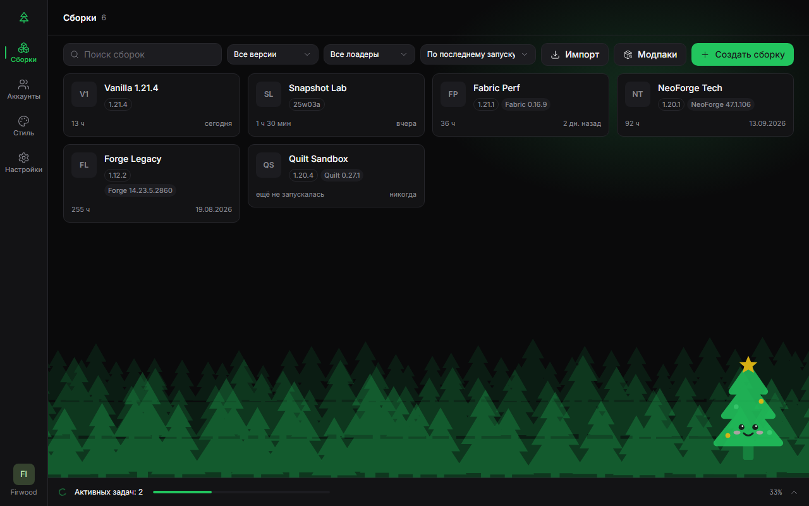
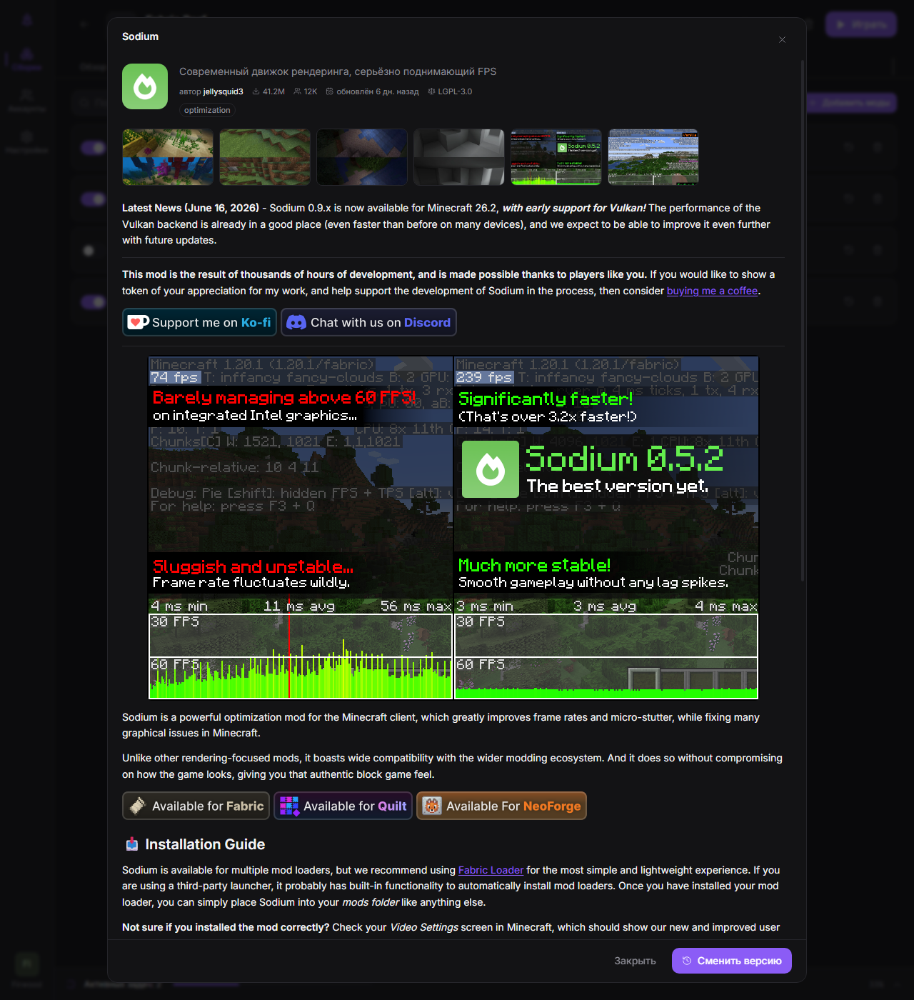
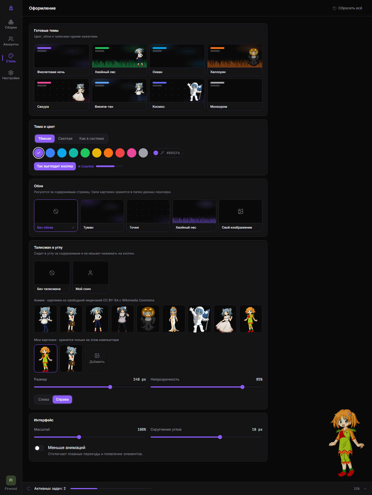

# FirLauncher

Лаунчер Minecraft для тех, кто играет с модами. Каждая сборка — отдельная папка со своими
модами, мирами и настройками, моды ставятся в один клик с Modrinth, а сам лаунчер выглядит
аккуратно и не мешает. Windows, macOS и Linux.

> **Бета.** Лаунчер уже умеет всё, что описано ниже, но пока проходит обкатку. Если что-то
> сломалось — [расскажите об этом](https://github.com/perdeyvariant-hue/FirLauncher/issues).

## Скачать

Последняя версия — на странице **[Releases](https://github.com/perdeyvariant-hue/FirLauncher/releases/latest)**.

| Система | Файл |
| --- | --- |
| Windows 10/11 | `FirLauncher_…_x64-setup.exe` — обычный установщик, права администратора не нужны |
| macOS (Apple Silicon) | `FirLauncher_…_aarch64.dmg` |
| macOS (Intel) | `FirLauncher_…_x64.dmg` |
| Linux | `FirLauncher_…_amd64.AppImage` или `.deb` |

Дальше лаунчер обновляется сам: когда выйдет новая версия, сверху появится кнопка
«Обновить и перезапустить».

**Первый запуск на Windows.** Установщик пока не подписан сертификатом, поэтому SmartScreen
может показать «Windows защитила ваш компьютер» — нажмите «Подробнее» → «Выполнить в любом
случае».

**Первый запуск на macOS.** Приложение не заверено Apple: откройте его правой кнопкой мыши →
«Открыть». Если macOS пишет, что файл повреждён, выполните в Терминале
`xattr -cr /Applications/FirLauncher.app`.

Java ставить не нужно — лаунчер сам скачает подходящую версию.

## Что умеет

**Сборки**
- Любая версия Minecraft с Fabric, Quilt, Forge или NeoForge — выбираете в одном окне.
- Каждая сборка полностью изолирована: свои моды, миры, настройки и ресурспаки.
- Избранное, группы и ярлык на рабочий стол: запускает игру напрямую, минуя лаунчер — видно
  только небольшое окошко загрузки, а когда игра открылась, и оно уходит.
- Импорт модпаков `.mrpack`, архивов CurseForge и сборок из MultiMC / PrismLauncher; экспорт в
  `.mrpack` или полный архив. Файлы можно просто перетащить в окно.

**Моды, ресурспаки и шейдеры**
- Поиск по Modrinth с фильтрами, установка в один клик, зависимости ставятся сами.
- Страница мода с описанием, скриншотами и ссылками на автора.
- Выбор любой версии мода, проверка обновлений и обновление выбранных или всех сразу.
- Каталог модпаков прямо в лаунчере; установленный модпак обновляется, не трогая ваши
  собственные моды и правки настроек.
- «Оптимизировать» — одна кнопка ставит проверенные моды для FPS и подбирает память.

**Когда что-то пошло не так**
- Если игра вылетела, лаунчер сам разбирает логи и объясняет причину простыми словами: не та
  Java, не хватает мода, моды конфликтуют, мало памяти, проблема с драйвером. Во многих случаях
  хватает кнопки «Исправить».
- Резервные копии миров в один клик и автоматически перед обновлениями.
- «Поделиться логом» — ссылка для Discord или форума, без ваших личных путей и токенов.

**Игра**
- Вкладка серверов: онлайн, пинг, описание и кнопка «Играть», которая сразу заходит на сервер.
- Статус в Discord: «Играет в <сборка> · Minecraft 1.21.1 Fabric».
- Вход через Microsoft и оффлайн-аккаунты для одиночной игры.

**Оформление**
- Тёмная и светлая тема, любой цвет акцента, обои, масштаб интерфейса.
- Талисман в углу окна — аниме-персонаж, ваш скин во весь рост или своя картинка.
- Русский и английский язык.

## Частые вопросы

**Можно войти через Microsoft?**
Да. «Аккаунты» → «Добавить» → «Microsoft»: откроется обычная страница входа Microsoft, пароль
вводится только на ней. Нужен аккаунт, на котором есть Minecraft: Java Edition. Для входа
лаунчер пользуется тем же идентификатором приложения, что и официальный лаунчер Minecraft, —
если Microsoft когда-нибудь перестанет его принимать, вход временно отвалится, а оффлайн-режим
продолжит работать.

**Где CurseForge?**
Поиск по CurseForge включится в одном из следующих обновлений, когда CurseForge выдаст ключ API.

**Где лежат мои сборки?**
Windows — `%APPDATA%\FirLauncher`, macOS — `~/Library/Application Support/FirLauncher`,
Linux — `~/.config/FirLauncher`. Папку конкретной сборки открывает кнопка «Открыть папку».

**Обновление лаунчера удалит мои миры?**
Нет. Обновление лаунчера не трогает сборки, а перед обновлением модов и модпаков лаунчер ещё и
делает копии миров.

**Нашёл ошибку или есть идея.**
Пишите в [Issues](https://github.com/perdeyvariant-hue/FirLauncher/issues). Если игра вылетает,
приложите ссылку из «Логи» → «Поделиться».

## Лицензия

Код FirLauncher распространяется по лицензии [MIT](LICENSE).

Аниме-талисманы — Wikipe-tan и Huijun-chan с Wikimedia Commons — распространяются по лицензии
CC BY-SA, авторы перечислены в [`public/mascots/CREDITS.md`](public/mascots/CREDITS.md).

Minecraft — товарный знак Mojang AB. FirLauncher не связан с Mojang и Microsoft.

---

Для разработчиков: сборка из исходников и устройство проекта — в
[docs/DEVELOPMENT.md](docs/DEVELOPMENT.md).
